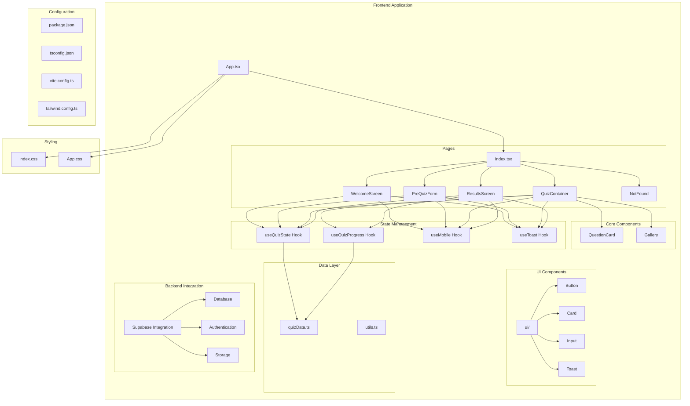

# Vibe Check

Techstack:

- Vite
- TypeScript
- React
- shadcn-ui
- Tailwind CSS
- Supabase

# Application Architecture

```mermaid
graph TD
    subgraph Frontend Application
        A[App.tsx] --> B[Index.tsx]
        
        subgraph Pages
            B --> C[WelcomeScreen]
            B --> D[PreQuizForm]
            B --> E[QuizContainer]
            B --> F[ResultsScreen]
            B --> G[NotFound]
        end
        
        subgraph Core Components
            E --> H[QuestionCard]
            E --> I[Gallery]
        end
        
        subgraph UI Components
            J[ui/] --> K[Button]
            J --> L[Card]
            J --> M[Input]
            J --> N[Toast]
        end
        
        subgraph State Management
            O[useQuizState Hook]
            P[useQuizProgress Hook]
            Q[useMobile Hook]
            R[useToast Hook]
        end
        
        subgraph Data Layer
            S[quizData.ts]
            T[utils.ts]
        end
        
        subgraph Backend Integration
            U[Supabase Integration]
            V[Database]
            W[Authentication]
            X[Storage]
        end
    end
    
    subgraph Configuration
        Y[package.json]
        Z[tsconfig.json]
        AA[vite.config.ts]
        AB[tailwind.config.ts]
    end
    
    subgraph Styling
        AC[index.css]
        AD[App.css]
    end
    
    %% Component Relationships
    C --> O
    D --> O
    E --> O
    F --> O
    
    E --> P
    F --> P
    
    C --> Q
    D --> Q
    E --> Q
    F --> Q
    
    C --> R
    D --> R
    E --> R
    F --> R
    
    O --> S
    P --> S
    
    U --> V
    U --> W
    U --> X
    
    %% Styling Relationships
    A --> AC
    A --> AD
```
